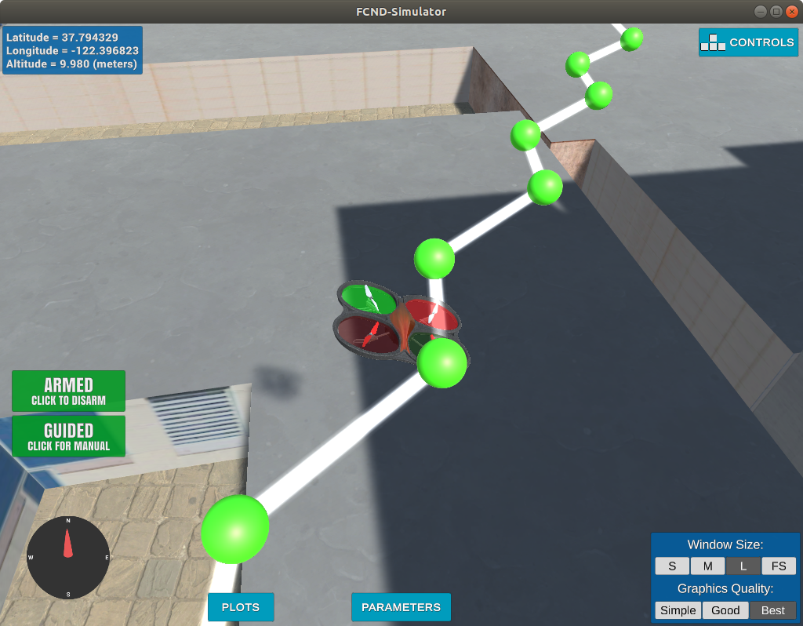

## Project: 3D Motion Planning


---


# Required Steps for a Passing Submission:
1. Load the 2.5D map in the colliders.csv file describing the environment.
2. Discretize the environment into a grid or graph representation.
3. Define the start and goal locations.
4. Perform a search using A* or other search algorithm.
5. Use a collinearity test or ray tracing method (like Bresenham) to remove unnecessary waypoints.
6. Return waypoints in local ECEF coordinates (format for `self.all_waypoints` is [N, E, altitude, heading], where the drone’s start location corresponds to [0, 0, 0, 0].
7. Write it up.
8. Congratulations!  Your Done!

## [Rubric](https://review.udacity.com/#!/rubrics/1534/view) Points
### Here I will consider the rubric points individually and describe how I addressed each point in my implementation.  

---
### Writeup / README

#### 1. Provide a Writeup / README that includes all the rubric points and how you addressed each one.  You can submit your writeup as markdown or pdf.  

### Explain the Starter Code

#### 1. Explain the functionality of what's provided in `motion_planning.py` and `planning_utils.py`


### Implementing Your Path Planning Algorithm

#### 1. Set your global home position
Open the file and read the first line. Use Pythons' re module to read latitude and longitude from string of known format:
```
    # Read lat0, lon0 from colliders into floating point values, and set home position
    with open('colliders.csv', 'r')as f:
        latlon_string = f.readline()
        f.close()
    
    m = re.search('lat0 (?P<lat>-*\d+.\d+), lon0 (?P<lon>-*\d+.\d+)\n', latlon_string)
    lat0, lon0 = [
        m.group('lat'),
        m.group('lon')
    ]
    self.set_home_position(lon0, lat0, 0)
```


And here is a lovely picture of our downtown San Francisco environment from above!


#### 2. Set your current local position
`local_to_global` souce code [here](https://github.com/udacity/udacidrone/blob/master/udacidrone/frame_utils.py#L9). Uses utm module to convert from geodetic frame in eastings/northings. So long as home and goal are in the same zone, then the difference in the local frame can be determined as the difference in the easting/northings. `global_home` is used as the origin of the local frame.


Meanwhile, here's a picture of me flying through the trees!


#### 3. Set grid start position from local position 
`local_to_grid` take the local position (frame centred on lat, lon given in head of the colliders.txt file), and computes the associated position the grid. This uses the the offsets `dn`, `de` in the north, east axes respectively.

```
    def local_to_grid(local_coord, dn, de):
        return (int(local_coord[0] - dn), int(local_coord[1] - de))
```

#### 4. Set grid goal position from geodetic coords
The same procedure is carried out for the goal as the start location.

#### 5. Modify A* to include diagonal motion (or replace A* altogether)
Add diagonal motions to the possible Action space. Cost of each diagonal motion is `sqrt(2)`.
```
class Action(Enum):
    ...

    # DIAGONALS
    NORTH_WEST = (-1, -1, np.sqrt(2))
    NORTH_EAST = (-1, 1, np.sqrt(2))
    SOUTH_WEST = (1, -1, np.sqrt(2))
    SOUTH_EAST = (1, 1, np.sqrt(2))
    ...

```

Updated obstacle logic to eliminate diagonal actions where necessary.
```
def valid_actions(grid, current_node):
    ...
    if x - 1 < 0 or grid[x-1, y] == 1:
        valid_actions.remove(Action.NORTH)
    if x - 1 < 0 or y - 1 < 0 or grid[x-1, y-1] == 1:
        valid_actions.remove(Action.NORTH_WEST)
    if x - 1 < 0 or y + 1 > m or grid[x-1, y+1] == 1:
        valid_actions.remove(Action.NORTH_EAST)
        
    if y - 1 < 0 or grid[x, y-1] == 1:
        valid_actions.remove(Action.WEST)
    if y + 1 > m or grid[x, y+1] == 1:
        valid_actions.remove(Action.EAST)
        
    if x + 1 > n or grid[x+1, y] == 1:
        valid_actions.remove(Action.SOUTH)
    if x + 1 > n or y - 1 < 0 or grid[x+1, y-1] == 1:
        valid_actions.remove(Action.SOUTH_WEST)
    if x + 1 > n or y + 1 > m or grid[x+1, y+1] == 1:
        valid_actions.remove(Action.SOUTH_EAST)
```

#### 6. Cull waypoints
For each waypoint, look at preceeding/succeeding waypoints and assess collinearity. If collinear, remove the central point.
``` 
def prune(path):
    pruned_path = [p for p in path]
    
    i = 0
    while i < len(pruned_path) - 2:
        p1 = point(pruned_path[i])
        p2 = point(pruned_path[i+1])
        p3 = point(pruned_path[i+2])
        
        if collinearity_check(p1, p2, p3):
            pruned_path.remove(pruned_path[i+1])
        else:
            i += 1
    return pruned_path
```

Collinearity check based on determinant of matrix formed when collating three points. This is the same as finding the area of the triangle bound by these points. If 0, points are collinear. `epsilon` represents a check for zero accounting for numerical noise.
```
def collinearity_check(p1, p2, p3, epsilon=1e-6):   
    m = np.concatenate((p1, p2, p3), 0)
    det = np.linalg.det(m)
    return abs(det) < epsilon
```

### Execute the flight
#### 1. Does it work?
It works!

### Double check that you've met specifications for each of the [rubric](https://review.udacity.com/#!/rubrics/1534/view) points.
  
# Some notes:
 - Added velocity check during `TAKEOFF` phase to allow time for craft to settle after moving through building ceiling above spawn point. Clumsy, but allows for a mission to be flown immediately after spawn.
 ```
    if self.flight_state == States.TAKEOFF:
        if -1.0 * self.local_position[2] > 0.95 * self.target_position[2] and \
            abs(self.local_velocity[2]) < 0.01:
            self.waypoint_transition()
 ```

 - Increased deadband (`WP_ACCEPTANCE_BAND`) to 2.0 in order to smooth vehicle trajectory in regions where waypoints have been selected in zig-zag like fashion.

 


